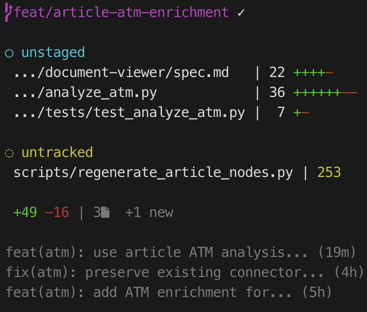

# gitwatch

Real-time git status monitor for your terminal.



## Features

- Branch with sync status (✓ synced, ↑N ahead, ↓N behind)
- Staged / unstaged / untracked files with line counts
- Smart path truncation at directory boundaries
- Compact summary: `2Δ +57 -3 1 new`
- Last 3 commits with auto-truncation to fit terminal width

## Requirements

- Git
- Bash
- `watch` (pre-installed on Linux; macOS: `brew install watch`)

## Install

```bash
git clone https://github.com/runsonmypc/gitwatch.git
cp gitwatch/gw ~/bin/
chmod +x ~/bin/gw
```

Add `~/bin` to your PATH if not already:

```bash
echo 'export PATH="$HOME/bin:$PATH"' >> ~/.zshrc  # or ~/.bashrc
source ~/.zshrc
```

## Usage

```bash
gw  # run in any git repo, q to quit
```

## Nerd Fonts (optional)

If you have a [Nerd Font](https://www.nerdfonts.com/) installed, icons are auto-detected and enabled.

## License

MIT
