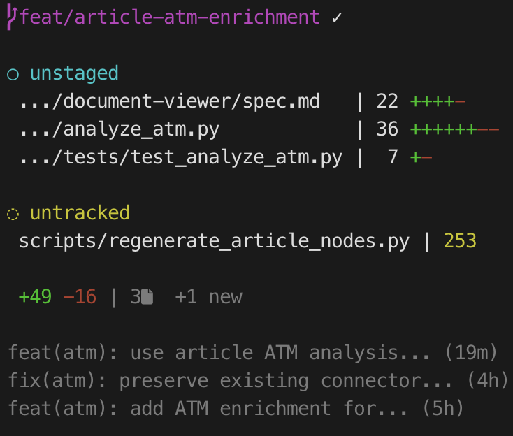

# gitwatch

Real-time git status monitor for your terminal.



## Features

- Branch with sync status (✓ synced, ↑N ahead, ↓N behind)
- Staged / unstaged / untracked files with line counts (`+27 -7`)
- Binary files show a signed size delta (`+98K`, `-2K`) instead of `Bin 0 -> 100251 bytes`
- Smart path truncation at directory boundaries — lines always fit the terminal
- Compact summary: `+57 -3 | 2Δ  +1 new`
- Commit history fills available terminal height
- HEAD and remote indicators on commit lines (◎ and ☁)
- Conventional commit icons: `feat:` `fix:` `docs:` etc. replaced with Nerd Font icons

## Requirements

- Git
- Bash
- `watch` (pre-installed on Linux; macOS: `brew install watch`)

## Install

```bash
git clone https://github.com/runsonmypc/gitwatch.git
cp gitwatch/gw ~/bin/
chmod +x ~/bin/gw
```

Add `~/bin` to your PATH if not already:

```bash
echo 'export PATH="$HOME/bin:$PATH"' >> ~/.zshrc  # or ~/.bashrc
source ~/.zshrc
```

## Usage

```bash
gw  # run in any git repo, q to quit
```

## Nerd Fonts (optional)

If you have a [Nerd Font](https://www.nerdfonts.com/) installed, icons are auto-detected and enabled:

- Branch, file count, HEAD, and remote indicators use icons
- Conventional commit prefixes (`feat:`, `fix:`, `docs:`, `style:`, `refactor:`, `test:`, `chore:`, `perf:`, `ci:`, `build:`, `revert:`, `skill:`, `case:`/`cases:`, `tool:`/`tools:`, `spec:`/`specs:`/`openspec:`/`openspecs:`, `experiment:`/`experiments:`, `delete:`, `calibrate:`/`calibration:`, `settings:`/`config:`, `merge:`) become icons

## License

MIT
